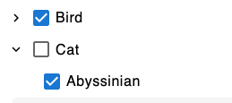

# MUI X Tree View Filters Component

> **Note:** 🚧 This project is a work in progress.

The `Filters` component is a flexible, reusable filtering system for managing hierarchical and standalone filters via MUI X Tree View. It supports customizable parent-child mappings, sorting, and label overrides. This document provides an overview of the main `Filters` component, its child components (`NestedFilter` and `StandaloneFilter`), and the data structure used in its implementation.

---

## Overview

### `Filters` Component
The `Filters` component serves as the topmost provider for managing filter state and logic. It uses React context to share state with child components and handles features like expanded items, checked items, and parent-child interactions.

### Features
- **Controlled and Uncontrolled Modes**: Supports `controlledCheckedItems` for external state management or defaults to internal state while also allowing `initialCheckedItems`.
- **Parent-Child Relationships**: Handles hierarchical relationships via `NestedFilter`.
- **Standalone Items**: Allows independent filters via `StandaloneFilter`.
- **Sorting**: Supports custom sorting for both parent and child items.
- **Label Overrides**: Provides customizable labels for filters.
- **Dynamic Options**: Offers behavior customization through the `options` prop.

---

## Props

### `Filters` Props
| Prop                  | Type                               | Default                                    | Description                                                                 |
|-----------------------|------------------------------------|--------------------------------------------|-----------------------------------------------------------------------------|
| `checkboxSize`        | `MuiCheckboxSizes`                | `'medium'`                                | Size of the checkboxes.                                                    |
| `initialCheckedItems` | `CheckedItemsType`                | `undefined`                               | Initial state for checked items (uncontrolled mode).                       |
| `controlledCheckedItems` | `CheckedItemsType`              | `undefined`                               | External state for checked items (controlled mode).                        |
| `onFilterChange`      | `(updatedFilters: CheckedItemsType) => void` | **Required**                            | Callback for when the filter state changes.                                |
| `options`             | `FilterOptions`                   | `{ replaceChildrenWithParentOnAllChecked: true }` | Configuration options for filter behavior.                                  |
| `children`            | `ReactNode \| ReactNode[]`        | **Required**                              | Child components (`NestedFilter`, `StandaloneFilter`, etc.).               |

### `NestedFilter` Props
| Prop              | Type                                                  | Default | Description                                           |
|-------------------|-------------------------------------------------------|---------|-------------------------------------------------------|
| `filterKey`       | `string`                                              | **Required** | Unique key to group this filter.                      |
| `items`           | `ParentType`                                          | **Required** | Parent filter items.                                  |
| `childItems`      | `ChildType`                                           | **Required** | Child filter items.                                   |
| `mapping`         | `MappingType<ParentType, ChildType>`                  | **Required** | Maps parent items to their corresponding child items. |
| `parentSort`      | `Record<Value<I>, number>`                            | `undefined` | Sorting order for parent items.                       |
| `childSort`       | `Record<Value<I>, number>`                            | `undefined` | Sorting order for child items.                        |
| `labelOverrides`  | `Partial<Record<Value<I> \| Value<C>, string>>`       | `undefined` | Custom labels for parent and child items.             |
| `options`         | `FilterOptions`                                       | `undefined` | Additional options for nested filters.                |

### `StandaloneFilter` Props
| Prop              | Type                               | Default     | Description                                                          |
|-------------------|------------------------------------|-------------|----------------------------------------------------------------------|
| `filterKey`       | `string`                          | **Required** | Unique key to group this filter.                                     |
| `title`           | `string`                          | **Required** | Display title for the filter.                                        |
| `value`           | `string`                          | **Required** | Value of the filter item.                                            |
| `groupWithChildren` | `boolean`                       | `false`     | Whether this standalone filter should be grouped with child filters. |

---

## Data Structure

### Enums and Mappings
The following enums and mappings are used to represent the parent-child relationships, sorting order, and label overrides for filters:

#### `PetType` Enum
```ts
export enum PetType {
    Dog = 'DOG',
    Cat = 'CAT',
    Bird = 'BIRD',
    Other = 'OTHER',
}
```

#### `PetBreed` Enum
```ts
export enum PetBreed {
    Abyssinian = 'ABYSSINIAN',
    Bengal = 'BENGAL',
    Parrot = 'PARROT',
    Poodle = 'POODLE',
}
```

#### `breedMapping`
```ts
export const breedMapping: Record<Exclude<PetType, PetType.Other>, PetBreed[]> = {
    [PetType.Cat]: [PetBreed.Abyssinian, PetBreed.Bengal],
    [PetType.Dog]: [PetBreed.Poodle],
    [PetType.Bird]: [PetBreed.Parrot],
};
```

#### Sorting
```ts
export const sort = {
    [PetType.Cat]: 3,
    [PetType.Dog]: 1,
    [PetType.Bird]: 2,
};
```

#### Label Overrides
```ts
export const Overrides = {
    [PetType.Bird]: 'Feathered Friends',
};
```

---

## Example Usage

### Basic Implementation
```tsx
<Filters
    checkboxSize="medium"
    initialCheckedItems={CheckedItems}
    onFilterChange={handleFilterChange}
>
    <NestedFilter
        filterKey="PetTypeBreed"
        items={PetType}
        childItems={PetBreed}
        mapping={breedMapping}
        labelOverrides={Overrides}
        parentSort={sort}
    />
    <StandaloneFilter filterKey="PetTypeBreed" id="other" title="Other" value="OTHER" />
</Filters>
```

### Explanation
1. **Filters**: Wraps the entire filter system and manages shared state and logic.
2. **NestedFilter**: Displays parent-child relationships with sorting and label overrides.
3. **StandaloneFilter**: Adds an independent filter option for items like "Other."

### Example Output

When users interact with the filters, the resulting state is passed to `onFilterChange` as an object. Child filters exist in the filterKey's `child` property, and respectively parent filters exist in the `parent` property.



```js
{
    PetTypeBreed: {
        parent: ["BIRD"],
        child: ["ABYSSINIAN"]
    }
}
```

---

## Notes
- **Parent-Child Relationship**: The `NestedFilter` allows seamless mapping between parent and child filters with options for sorting and label customization.
- **Controlled Mode**: Use `controlledCheckedItems` to manage state externally. For internal state, use `initialCheckedItems`.
- **Extensibility**: Additional filters or components can be nested under `Filters` as needed.

